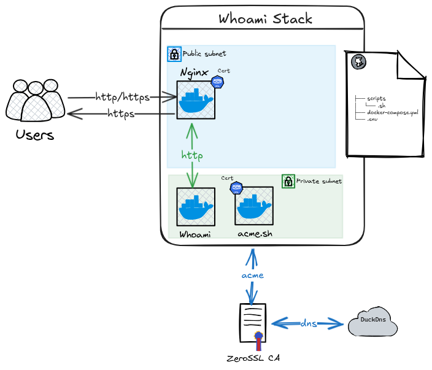

# Whoami Docker Stack

## Overview

The **Whoami Docker Stack** is a lightweight, containerized solution designed to demonstrate a simple web service that outputs system and HTTP request information. It integrates with dynamic DNS and SSL/TLS certificate management to provide secure access to the service.

### Architecture

The stack consists of the following components:

- **Whoami Service**: A minimal Go-based web server that outputs system and request details.
- **Nginx Proxy**: Acts as a reverse proxy, handling HTTP/HTTPS traffic and terminating TLS connections.
- **ACME.sh**: Automates SSL/TLS certificate issuance and renewal using the ACME protocol.
- **DuckDNS**: Provides dynamic DNS services for domain management.
- **ZeroSSL**: Certificate Authority (CA) used for issuing SSL/TLS certificates.

Below is the architecture diagram:




## Deployment

### Prerequisites

Before deploying the stack, ensure the following:

1. **Docker & Docker Compose Installed**:
   - Install Docker and Docker Compose on your system.
   - Verify installation using `docker --version` and `docker-compose --version`.

2. **DuckDNS Setup**:
   - Register a domain on [DuckDNS](https://www.duckdns.org).
   - Update your public IP address in DuckDNS.

3. **Network Configuration**:
   - Ensure ports `80` (HTTP) and `443` (HTTPS) are open on your server.


### Deployment Steps

1. **Clone the Repository**:
   Download or clone the repository containing the `docker-compose.yml` file and supporting scripts.

2. **Prepare Stack Configuration**:
   Update a `setup.env` file for the following variables:
     ```
     VIRTUAL_HOST=your-domain.duckdns.org
     DuckDNS_Token=your-duckdns-token
     DEFAULT_EMAIL=your-email@example.com
     ```

3. **Run Docker Compose**:
   Start the stack using: `docker-compose up -d`


4. **Verify Deployment**:
    - Access your domain via HTTPS (`https://your-domain.duckdns.org`) to confirm everything is working.
    - The Whoami service should display system information like hostname, IP address, and HTTP headers.

5. **Use Systemd for Additional Control** *(Optional)*:
If you want more control over stack startup, you can create a Systemd service to manage it:

    - Create a Systemd service file, e.g., `/etc/systemd/system/whoami-stack.service`:
    ```
    [Unit]
    Description=Whoami Docker Stack
    Requires=docker.service
    After=docker.service

    [Service]
    Restart=always
    WorkingDirectory=/path/to/your/docker-compose.yml
    ExecStart=/usr/local/bin/docker-compose up -d
    ExecStop=/usr/local/bin/docker-compose down

    [Install]
    WantedBy=multi-user.target
    ```

    - Enable and start the service:
    ```
    sudo systemctl enable whoami-stack.service
    sudo systemctl start whoami-stack.service
    ```

## Notes

- Certificates are automatically renewed 10 days before expiration by default.
- Logs for debugging can be accessed using `docker logs <container-name>`.
- For troubleshooting, ensure that DuckDNS points to your server's public IP and that ports `80` and `443` are accessible.

## Pre-Commit

Pre-commit is a useful tool for ensuring code quality and consistency in this repository, therefore it is mandatory.

To install pre-commit, follow these steps:

1. Make sure you have Python installed on your system. You can check by running `python --version` in your terminal.

2. Install pre-commit using pip by running the following command:
    ```
    pip install pre-commit
    ```

3. Once pre-commit is installed, navigate to the root directory of your repository and run the following command to set up the pre-commit hooks:
    ```
    pre-commit install
    ```
4. Then run following command to set up the pre-commit message checker.
    ```
    pre-commit install --hook-type commit-msg
    ```
If required to unistall pre-commit please run `pre-commit uninstall`.
